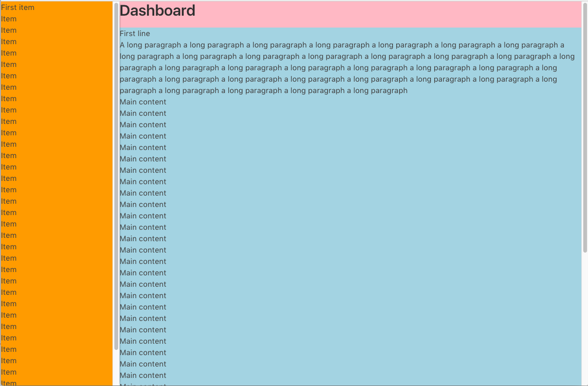
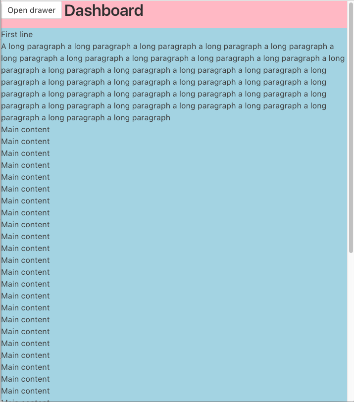

# html-dashboard-layout

Simple responsive dashboard skeleton using [Bulma](https://bulma.io)

The mobile breakpoint is set to a width of `768px`.\
Above this width, the drawer will be visible.\
Below this width, the drawer will be hidden.

##### Desktop

##### Mobile

#### Todo
| Done | Task |
|---|---|
|  | Add overlay when drawer is open on mobile |
|  | Click on overlay to close drawer |
|  | Prevent scrolling in main content if overlay is present |
|  | Add functionality to toggle drawer |
